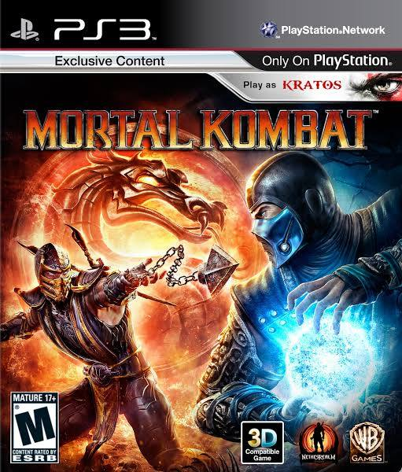
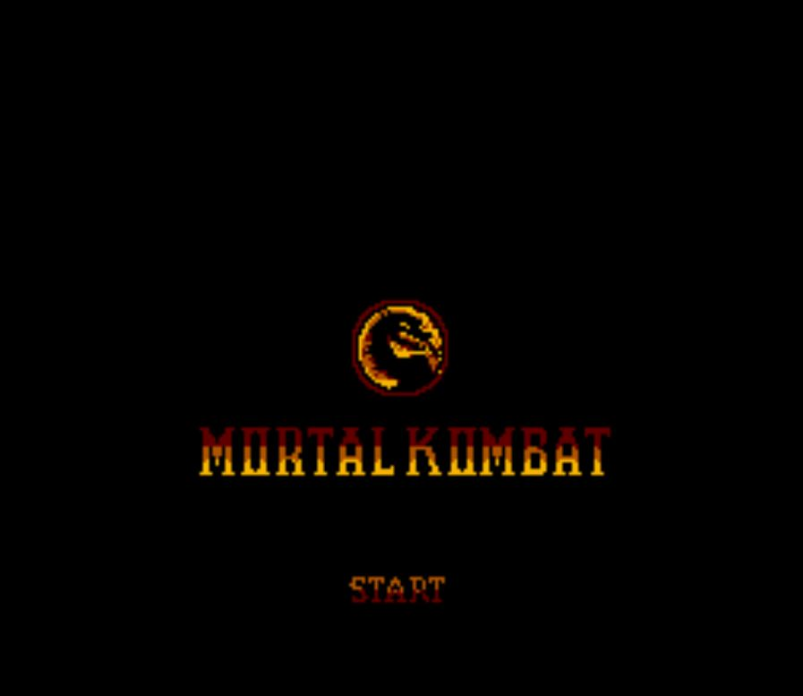

# Mortal Kombat

<a href="https://8bitworkshop.com/v3.12.0/player.html?p=nes&r=TFpHAACgEAAANZTp5KxhAbe2um5ORVMaAgEAbgd4ov%2Ba6I4BII4QQI4AICwCbkIQ%2B26DqUCNF0CpP40GII4GIKkPoiCNByDK0PqKoCCMBiC6DqAQugno0PqI0PeKlQCdAAGdAAKdAAOdAASdAAWdAAadAAfo0OapBCB5giBOgiCugiAgsCAFrqkAhSWpCIUmIPSEqUyFF6kQhRipgoUZqYCFE40AIKkGhRWlBMUE8PyiNKAYytD9iND6rQIgKYCFAyCAgqkAjQUgbkIDIExJq0iKSJhIpRUpGNADTOaBqQKNFEClCroEwIGiAIYKtgayrMABsQuNByCqrMG6wazCbuXDbuSOugPFusOsxm7lx7YIE8m6w6zKbuXLtggTzbrDrM5u5c%2B2CBPRAbENukvSbuXTbuS6U9W6w6zWbuXXtggT2brDrNpu5du2CBPdusOs3m7l327kpQbwC6kAhQalCfADIIODqQCNtiOUpQ%2BNBSClEG6CtiJOpRWNASDmBOYFpQXJBtAEuikFIBcAaKhoqmhAtiM%2Bqf9M%2BYGFGIYZYIUahhuiAKkghRygALEancAB6MjGHND15gq2BhIQ0OS6ghCK0NuFGiAArykfqqW6YbobqQ%2BiALpr4CDQ%2BIYKYKq9IoSFDb0rhIUOhbYFBgu6Rgy6BiBdgopMa4KlFSnnhRVM8LoBCRi2BgEI0PVuoRDQ74UVYKUDogBgpRNugYUTYKIAqf%2BdAALobgHQ92AKbgIpIIUapRMp3wUauhiqqfC2CBepAYUGtkRDpQPwBqUFyQXw%2BrYJDWCFGorQDqUayfCwCIUQqQCFGvALOKUa6fC6BQKFGiBMroUPiikBBRq2A1j8tgNYKQEKCgq6iPe2CAi6ye%2B6ibYiErpyHIYdoACxHI0HIOYc0ALmHaUa0ALGG8YapRoFG9DnYIUHhggFCIUJuoG6IQfIyUCwEo0GILoCbqUHIEyFg6qlE%2BCAkAjg%2F%2FAqCQTQAin7jQAgiim2QtG2ByGquuXK0Pe2I%2BK6LWCOtiP7YLoOYLYCgSAAr6Yd8AyiALqf%2BsYd0PamHPAGusZgCQDwAqkEtgO7%2B7YCu7o8YKUEogBgqiDwgrpZNERUZHSElKS0hG4GD24dbg0AAQIDBAUGBwgJCgsMuggQERITFBUWFxgZGhscAAAAECEiIyQlJicoKSorLBAQEDAxMjM0NTY3ODk6OzwgICAwbh1uDaAA8AepAKKFTBIDYCkDqr0NhaogAK9MS4kADx4tjWUFjmYFhQCGAbaDb0mASo1kBSBshaABsQCNZwXIbqFobqNtbqNuAAWp%2F41hBY1jBakPjRVAqYCNCECpAI0PQKkwjQBAjQRAjQxAqQiNAUCNBbpQSgWNbwWiN6kAnRQFnQ8FnQoFnSMFqTCdKAXo4DzQ6KIAqRudFgWpip0hBbocCwWdALoRC9DpTASJrmUFhgCuZgWGAaAA0QCwXAqFAAqqCmUAhgBlAGkFqK1lBYUAIGyFojexALouyG6hBQXIthVh3K1kBfACyLodjWm6Y41qBakAjWsFqQaNbAWNSgVgqvAYIASJugwABY0DBY0GBY0JBa1KBQmA0G7CKX%2B6XKUASKUBSLoHMALQA0zuhhitawVtaQW6P61sBW1qBc1KBbC2AkhMsoY47UoFugKiNyBWiJALogCtRgUgA4iNXwWiOLrKA61HuopgBaI5ukoIogatSLpKojq62QmtSbqZYgWiAL0LBfAF3gsF0Cu9FgWFAL0hBYUBvCwFsQAQCRhpQLYC9dAN0AfIsQCoTMuGyJ0LBZidLLYjP8atQQXwIhhtAQUNZAWqrQIFqH0eio1xBZgJfzACqQB9noqNcgWtAAUNXwWNcAWtQrqlBLrlBbrldLYKJXUFrQMFDWAFjXMFrUO6pQe65Qi65Xe2CiV4Ba0GBQmAjXYFrUQF8BgYbQoFKQ9JD4UCrWIFCimABQKNegWtCQUJ8I15BaIAIGaJog9ugh5ugi1uga1wBY0AQK1xBY0CQK1yBc1hBfAGtkJyA0CtcwWNBECtdAWNBkCtdQXNY7pSYwWNB0CtdgWNCECtdwWNCkCteAWNC0CteQWNDECtegWNDkBohQFohQBgCqitaAVpAIUBrWcFhQCxAIUCtkI1FrZCEMidIQXotgYFtkSMCgWdKwW2QpIsBeAJsBPotiJYugS2CR2lAmC9FLYimhQFGGC9ALYimgUFhQGgALEA5gDQAuYBCQAwDEqQA%2F4UtkKPOLBeKX9KsAcKCp0PBZDcyT2QS%2FAryT7wNBilAGkDnRkFpQFpAJ0etgJZI7YCWbYDloUBpQKFAKAATGyIsbZiTeYA0KLmAdCetgsXiLoWnRQFvSMF8BLeIwXQDb0ZtmJIvR4FnQW2Qra6BKUBukO2Y7JgtmLroACtZAXQtmQRe7ZjEXy2IoQxiYoYaQ%2Bq4DzQ9GCpAJ1%2FBZ19BZ2ABZ2HtmJKgQWdhAWdigVgCqi6Ia17BYUArXwFhQGxAJ1%2Bunu6J2C9fbYiCH0F0Da9fwXQAWCFAb1%2BuiC8gAUYsQAwDfAcyJ19BZidgAVMponIhgJlAqq2InQBBaYCTIGJujmtcAUpD4UCvYFuwcUCkBK6AY1wBb2CBY1xBb2DBbZCrnO62oS2BhqEtkKOvYUFjXQFvYYFjXUFvYcF8A%2BNdgW9iAWNdwW9iQW2Qop5uu6Kuu4MugGNeQW9iwWNegVgwAAAADPahjbrpWIj5696SBnswpp1UjAR89e8o4x1YEw6KBcI%2Bevd0cW6AK%2BlnJOLg3x1bgBoYlxXUk1JRUE9OjYzMC0rAK1N8p1MALh0NPe%2BiFYm%2BM6lf1s5Gfvew6qSe2ZSPy0cDP3u4dTIvbKon5aNhX52cGljXlhTT0pGQj46NzQxLgAGBQUFBG4BA24CAm4EAW4JtwgCwW4UBrp5unq2HTluBAExiz6LQYsojKqMY42KjTMBAAEwOYs9biEAz38AAMB%2FAAH7AYBEiwCLbmJKbuVObuVStgUEulBuYrpIbuJYtg0IQG5lSG7ltgYMtgY0PG5ltgJMbuK2Bgxu4rps%2F4BEi%2FnlbiRciwCZbmq2AmRibiG2EhBSbiH%2FMNBubwD547YERf9AhLYDUf1DtgdYbia2Au2Zbmq2BLFKtgKdtg8QOm4h%2FyM5jItEhQCDbmGRbuWt%2FzA5jG5ytgd6bib9KIy2CnK2IwNuYrYCVrYOCP8gs4xuZrYJgrYLHLYlo7YSFI06iwCJ%2FyffjLpRhUSHAIdu4af%2FON%2BMbnO2CWVucv2qtgexbjb%2FIGON%2FWONbsK6g4qNmW4hm42EdIUEgz%2BJ8AMAIK6CqcqixCARgqIjqcAg1IO6BsMgNK%2BiAKlAIE%2BDTImCugWpmTjtAgONVwMgSq8gP66peKADkSWpEIiRJa1XA0puARhpMLoFqQNugaAHsSWFLohugS2gALEtIN6woAAgla%2B2BTKAtgoyKQ%2B2GzC6sLYCc0G2CXMYth1ztgdzILYdc7YCc0K2CXPYth1ztgdz4LYdc61TA%2FA9uvWtNwO6dq05AzjpHrp6U7YcOro6VLYIOji6%2Bjq2BjpUthw6la9MVK4gHq%2BpAI1YA41ZA61YA8kCrVkD6QBQAkmAMANMqZm6CyCDsKABkSW6Qo66LpElKUDwUboGhS26IxhpA4UuoDexLfA9ugsYaT%2Boug1pA6qYoAAgbK6q0Ci6jju6pLpjqf6RLbqLQ7YICwFMxJCosSUpgPBOtg9PyfCwObYTUSO2DlECtg1RTL%2BQtgxGObEtyaGQFLYOMACokS2gAbElKQLwRLYSKS%2B6qT22BneFJ4YotgN7GGn2kSe6lD%2B2CcO2BX22Bye6ozjpAbYiSRActhdDApEnyLElKQHQA0z7kroBgLYGARC6gbYMkFGxLfADTPmStiKyASAAhbYDTke2CX2gALYDf7YsQiAyr7oMrlkDIOKthS0YqbYGD6uvIO6uyRiKtiftspe2ByAYaUGoirYCoyA0thA1QbYGTLYJYFOxLRhpB5ACogEgjay2RJy2CERRhS2KthmZhbYiRrYPmMUnkB%2FwHbYJPje2BT62Qr8YaQdMnrYiFrYSFTjpB7YOXlOxLckFsDK2IylTtip%2FhS2GtgVJAbYlzVW2KEg3ur%2B2BltThS2KTL2XtkMrtiKoo5SIugIgugKhlLYyoKGUtiugSbY%2FoLY%2BoLY9oEa2Iha2PqC2PaDQA0wWlrYioLZiSBSWtjKgFJa2K6BLtj%2BgtiigBLY8oLYL8zm2BRG2KFS2BhI%2Ftgcrtj5rtjpryLYC8rYvYcaXtithRbY%2FYbYoYQO2fgm2fAkHTFe2Cqe2fgm2O5a2I5a6%2FLbR%2BATQA0ybtuLpti%2Bquo62LzzJLrC6U4q2KcYNWQPQC41OA6kBjU0DTFyYogC6Ak8DjlADjQ8DjhADti8zjQcDjgi2EQ8JA44KthAPtlwCtkQCh7YIqRhpQbYmtmW2bR%2B2KM%2B2Ps0HTCy2CnK2ZoC2Ps22Ns2StgJtti%2FN7lgD8ANMzY%2FuWW6iTFSuqQCNWgONWwOtWgPJAq1btwgB3%2BiaugsYaTeoug22Zi1aA65bA7oBqRQgtK4KCgoYaSi2ZA%2B6YjmFLbqjhS6peLYjTbpNO7YHDZi2BQo9tggftiJbuks%2FthALQbYPMEO2Dwq2gh22DApHtg8KtuJStgwKtqK8tgcKjU0DjU4DjU8DjVC2Avq2I%2Fe2DSi2Ijm2BwruWrYiN7SZ7ltuoqIgqQAg1IO2KjvAuiTpA7YiOxAfugi6tBhptIUuoMqxLSDbg7o50Ne6dveaYLYiSg8DDRAD8FytCwMYbQcDjQcDrQwDbQgDjQgDrQ26CwkDjQkDrQ4DbQoDjQq3BQSHrQe3BAPOCQOIkSWpAW6CzrcZBMQAjVwDjV0DrVy2IthdtijYHam6C4Utugu2akOpAyAPsI1eA45fumq2DBeFJ7oLrl22UPYV8BO6ErYkm122IyOKTBectg0LtqUgXAMNXbYiPPOhupg%2FqLqXtwUDDNADTOG6cLYJcEOxLfBItgLxMq62D4mgApEltgwNOboNAZEloAa2KwSRJalwosZMxqe2HUC2EECsosVMxqe2DCVFsS3QA0yanbYesbYLaaG2HbG2FUDdthGxR7YDsVOeth6xtgtpdaLHth2xthNANLYDQLYMJUm2A7EMn7YesbYLade2HbG2FUC2ALYRsUu2A7HFth6xtgxpA7YdsbYVQNK2Q2utTQMNTgPQA0xzoLYeprYLXnmiyLYdprYTQPi2Jl8YaTu2i0XJAPADTDC2gl%2B2HrW2CG0Otn2OthVASrZxjrYCm1i2HVO2D1OtXgOuXwOGNQomNRhpnYUtpTVpzUy9th2rthtQGGmXtgdQtrTFrqK2Pna2Ky4Cosu2PXa2E0A%2Bosq2tcVno7YesbYLaTO2HbG2FUBvthGxtqTFIKS2HrG2C2kHosy2HbG2E0DGtgP5trLF2bYesbYMaWm2HbG2FUBItgNAtrLFkqW2HrG2C2mVtl0jthVAZLYkak8DDVC2osVAprYeprYLXru2PV%2B2FUCKtiZftrPF%2FbYetbYMbaC2Y0a2HUC2EEDcosm2vsW2um3Btr7Ftg1Qu7YEUIUuyLEtqoixLSCUtwUQSbYihje2JoaFL4YwtwYGg7cDBAm2LqIYZSeRL7YPd8mpkEC6pT22CyU46QFwAkmAECS61LcHBCWYtwMEIrcEBhK2DAo5thmBtgxUtgSBAwOuBLcDBqsPIA%2Bw4ADQUMkA0Ey6pkW2B1SKqLYFVUe2CAu2BQpJtg8KS7YKCkwPqbYIWjK2BFoQyQDQDLcKBlHuXAPwA0yUm%2B5dbqJMVK66K8k3rQQD6QCpAJBSjQMDjQQDrQIDyZmwCyAyr6kBII2sjQIDqQCNYAONYQOtYAPJAq1htwUFsgq6Kx%2B6C7cEBqNhtwkH0mAD0NTuYQNMTqm2EjAQZLoIuqq2JIxVsS3wtgRAVai6v7cMCF446QGRJ7YPKtAUuqpTthBykrYCcoapYKIAtwUUK2QDtwUTuWW6gUIDjWYDrWQD8A6tZQPwCa1mA%2FAEikwtqqkBjQADjgEDrQADDQED0AFgIK6CIICCuh3NZgPQTLcIB1piA41jA61iA8nArWO3CAdaYrYCmWMDGGnAhS6gCrcEB1piA9DX7mMDTFmqqTqixSARgqkKosRMNau2BEyQTvC2HE62BU64hS6girYMTq%2BqqQq2BE5KtgNOthxEtgREvIUuoEq2DET7qqkqtgREiqLEtwgVc7cFFYhMiYKpAI1sA41tA6keoosgEYWplaKNIAqJqQAgqoWpO6KGIAyCtgh3agONawOtarYCd2u2CHdqtgJ3awMYabG2KBlqtgJ3awNMeqsgroKp6rcYFfwgiYJM5asgg7CNaQMpAvAKug8BjWwDjm0DINuCrWwDDW0D8OEggIIgrJkgpY26Zn%2Bs7gMD0APuBLYmyXOqjWcDrQQDyQDQBbZC7x6wKa0FAw0GA9AhIDKuqYC2gqSpeIiRJa1ntwMIx06izSCUsLosTE%2BsqQGNBQOOBgOtaQMgHq%2BtaAMgwo%2BpASAug6lnogMgJ5tuw8eNujLwAyDOgiDbgiAgqSD7qbYFkgNM%2FKtMbIUgNK%2BlPaY%2BbsI7pjxuwaAHsSWqiLElGGlmSIppBqpohT2GPrZC8LoMulBFLYU7ikUuhTzIusgYZT2FPYplPoU%2BpTtFPUilPEU%2Bqmgg8K2oiikRqpgpEIU7hjwgfK%2B6erYDWoevBbp6Bbo6pT045TtIpT7lPKpoSKAAsSWZOwDIwATQ9mhMZ66sEQOp%2F5kAAWCpAI0RA0wmrSBuQduCTC%2BtIB6voAGiBCBmtiKBfDigAPElSIrpAKpozREDtwUMyBADIDetogEYrREDkAHotmOuBLElSUCgAJEt7hEDoAOxJawRA5kAAbpFALYJBbYHLLYoEKAEoroaIHiuumEYbREDjREDICatoAGxJYU9yG6BPkxirshIGJhlJYUlkALmJmhg4ADQBqrQA6kBYKIAimBJ%2F0iKSf%2BqaGC3AyD9x6LNTBIDYKnHhS2pzbaCG4UvqQOFMKLIqf%2BFNaAA6PANsS2RL8jQ9uYu5jDQ8OY10O9gpSU46QOFJZABYMYmuoUEtgYFtgJ%2BtiJ%2B5iXwBW5hA2DmJea6DgVM1a2gCG6BtgLzogCxLRABymAgoa6mMvATtgNXboPQ9LYCXMrQ7aYx8Ai6isrQ%2BExMroUxhjIgDK%2B2ItmGMLbiCC9ghTO6CZigCKYu8B2FNEYzkAsYZS2qpS5lNIU0imY0amYziNDrqqUzYLoTA7oTuon1ukngABANGEn%2FaQG2Av1pALYD%2F7YDqAFgtgKitiI%2BtuRsTFS2I1qkJfAHxiWgAJElYMYmxiVuwakAogBItgLuAoUlsALGJqABipElaIi6EqADtgkPtiQBunHIuhhgtTlIsSWVOWi6B7U6ukM6ugNghjVGNWpuQaY1tgcDusZIhDW2CYSkNWiRtgKJogA4Sf%2BgAHElyLYCtnElqmhM1K2iAIUzhjQgDK8g0a%2BlLaYuYKkAhSigEKY08B8GLSYuKiYoqsUzpSjlNJAIhSiK5TOq5i2KiNDkhSdgupewBMUzkATlM%2BYtiNDuug22C0cnpihgqTeFLam2xDaiAPAKkS3I0PvmLsrQ9sA38AW6RvdguhGpAY0WQKkAboIIhRq5FkBKdhvGGtD26OAD0OOlG8Uc8AbFHfACpRyZPwCqWUEAOT8AmUMAiplBAKIAYEggQ7BoqrVDugOqtT9uoYUahhugArEliIUfboIgsSWqsRrJgPAjyBhlH50DArEaugEgnQC6QZ0BbqMCtwMl7UynsKUlaQK2RPKKtgJItiK9ulZuoroibqG6LiW6PKUlGGm2QrG6YboCuiS3Gx4Bbh9uH24ebhxuBMDBwsO2GhjQ0dLTthoY4OHi47YaGPDx8vO2HYxuBOTl5ufo6err7O3uxMXGx8jJtg0Y9PX29%2Fj5%2Bvv8%2Ff7U1dbX2Nm2P0NuE8rLzM22H3xuHm4EtwUh1QICLQAALgIvtgkSLrpOLxC2Che6CLYMFwICugK6W7oXtgkRul62BTEALk%2B2DGm6sLYKPz62C266SwEBtggaumY%2BtgsZLgJtegJOulkubmE%2Bulm65pqNupiKewICfH22ApICuLkvuhVOtgSfnQCMq6ysrLwCAmxrAgK9raysSagCuwK6eU66WJu3AyLlAwNdWwMDWmq6xAO6ALYF97YDUrcEIvS60brEPgIsJSYgHxUUulcuvs9cTExMXG4FTEy%2FzgICKygnER4WEz%2B6GAK%2Bzj62Bsq2IxK%2BuhgqEiIhHRcYAbrYtgJgupW6WLpIAikkIxwbGhm2Bhgvung6O7qYPrpYAwgKCgoHAwO6GLqIuhhKAQFLuj26qE4DAwkJCQO6mLpIuli2ArG2B1i2DRhOtg8YBgsLCwW62LpPtgYYtgJYtgL4DG4ebh1uBQRuAg8PbsNuEw5uAQ9uAbrDDw8NugENDQ0ODg26AroOugu6W24DugK2BQW6jQ26rbYJFw0EDro9DQ8ODwRugbpdtgRYuue6Tg4NDbofbqG6SQS6WLoGtgdUtgNvuh%2B2BwkEuvkNtgKEtgaQug62CAS6PLpDuoJu4bYCwW6iumm6jA62acJuIrZFpW6CtiKrtgsVtiLNbgJu47oIutC2igC3BiXlAbp7tgs4A7o2uha6cwO6Abo3tgcyury6SQMBuhNuIW7DtggXbgS6dm5iboQDAbYOmLZlaLp2upy2DTm2Bze2Bhy2Dli6rG5CbiG2AqO2j%2BC6EboQboK2CBi2Bh4CugMDAQG2Qtm6drq9tg84tiINtgOVugW2LBW6l7oQ3m7E327Cti04tgKYArYE3m7DtjAYupQD2ttuw7YJNbYFArYiTbZjn7YG%2FLYLFrpCtgOv3N2697YOV7YFerYkPbYSFwK6GLZEO24jtkkStgVfujEAtwUn8AEDtgwWuqW2Ala6ILo1tiKWtgkYtgYDtim7tgUXti09tkV5tgiVtlU8ttrHtxIok7YmKrZE87ZD9rrKtgNCtkdOtwYo4LYIF7ZE4LZIb7YPGLYOJrYPN7YSJ7YMCLYkZG6Ebgy2Jw62Z862KiO6jbZm7br5tgbhtqOktmX9uqC617YHjrqatgZPurtuwrYKF7YGGW6Gtg8Xuhm2CxgCthIYtgRxboW2EBi2BbC2Bxi25lRu5LYPGLcKKne6GbYGGLYGHbYVGLYkAbrYtuW6bsO6mLqSthkYtmoJthNYtgR6utq62bcFKx%2B2ZES2poNuxbqXbsa2CDi2BYK2L%2FZuxLYFW7YWGLYHnLYNGbZJHLYLgbYKF7ZGUbYRObYGBrYJtrYKGbYINrYODbYILrZId7YIGbZD6rZkbm4ItkjXtku4tmkVtm1OtmlCtoOvthAZtggLtgJMthgYtg4mtg83tniwtgYItvJ4tobBuiG2yFq253i2hi66XbZozrYKWbajRbrJtgYYtud4tgl6tqYktut4bgW2Iw%2B2CXi27Dm2Bju2yGC2CxO2FRi2DTduQ7YHWLbneLZluLYF4LYJeLbkeLZmOLYmPbbueLYHGLYFGrbueLqTthAYtud4tgcYtiVitu54tgh4biK2CZi25Xi2Zri25P22w8u263i2ZNm2BFS2Cli25ni2KPm2DRi25ni2FRi25nhuBbYER7YHGLboeLZoQ7ratu94tgdWtkZYtux4tgdWtsxetud4tgk2ttButiRtuna2Jf23DgBBtoXYAbZFx7Zrz7aOurYEYbbyeLYJI7ZiLLYYGLZmALYVWrbumbYSGGVVbgSqpqSl6Pumpvr6mqqOr6qqDw%2BZqqiqqqoAAAm3AzkptxcAakiqqvAwAAAIiKqq%2F%2F%2B6CCCqqj%2FPAABSCKqq8%2FwAAAK6GLpQCAiKqv8DAABUtgJl%2Ff9wBW4CDw8HuniqqmZICIiKCiqqJrq4qqogEbo4iqqKJkC6eLoIBLo4KKoKACG6uFVVUbq4bgH%2F%2F19fX9%2F%2FbgG6T272%2FW7h927DV7r4XbYGODEOABcxDDAXMQYXGzEXGygWHTcoAB03LA0tOgANJxYdDgYXJ25utgr3BgAtMAYtDygGFicwBgsaKbYuFzC6GDAQIQ8wuhgwPDERBhAxMAYwtgUouhD46bod6QEACOkCAPjwAwAA8AQACPAFAPj4BgAA%2BAcACPgIAPgACbodCgAIAAsAgPjpQLopQbopQropQ7opRLopRbopRropR7opSLopSbopSropS7ppULopUbopUropU7opVLopVbopVropV7opWLopWbopWropW7ppELopEbopEropE7opFLopFbopFropF7opGLopGbopGropGwCACOkAQADpAUD46QJACPADQADwBED48AVACPgGQAD4B0D4%2BAhACAAJQAAACkD4AAtAuilAuilBuilCuilDuilEuilFuilGuilHuilIuilJuilKuilLumlQuilRuilSuilTuilUuilVuilWuilXuilYuilZuilauilbumkQuikRuikSuikTuikUuikVuikWuikXuikYuikZuikauikbQID46SAAAOkhAAjpIgD48CMAAPAkAAjwJQD4%2BCYAAPgnAAj4KAD4ALYi1yoACAArtgLtIEC6KUD46SJACPAjQLopQPjwJUAI%2BCZAuilA%2BPgoQAgAKUC6KUD4ACtAgPDwDAD48A0AAPAOAAjwDwDw%2BBwA%2BPgdAAD4HgAI%2BB8A8AAsAPgALQAAAC4ACAAvAPAIPAD4CD0AAAg%2BAAgIPwCAEPAMQAjwDUC6OUD48A9AEPgcQAj4HUC6OUD4%2BB9AEAAsQAgALUC6OUD4AC9AEAg8QAgIPUC6OUD4CD9AgPD4gAD4%2BIEAAPiCAAj4gwDwAJAA%2BACRAAAAkgAIAJMAgBD4gEAI%2BIFAuhlA%2BPiDQBAAkEAIAJFAuhlA%2BACTQIDg8MAA6PDBAPDwwgD48MMAAPDEAAjwxQAQ8MYAGPDHAOD40ADo%2BNEA8PjSAPj40wAA%2BNQACPjVABD41gAY%2BNcA4G4h6ADhAPAA4gD4AOMAAADkAAgA5QAQAOYAGADnAOAI8ADoCPEA8AjyAPgI8wAACPQACAj1ABAI9gAYCPcAgCDwwEAY8MFAEPDCQAjww0AA8MRA%2BPDFQPDwxkDo8MdAIPjQQBj40UAQ%2BNJACPjTQAD41ED4%2BNVA8PjWQOj410AgAOBAGADhQBAA4kAIAONAAADkQPgA5UDwAOZA6ADnQCAI8EAYCPFAEAjyQAgI80AACPRA%2BAj1QPAI9kDoCPdAgOTwdADs8HUA9PB2APzwdwAE8HgADPB5ABTwegDk%2BIQA7PiFAPT4hgD8%2BIcABPiIAAz4iQAU%2BIoA5ACUAOwAlQD0AJYA%2FACXAAQAmAAMAJkAFACaAOQIpADsCKUA9AimAPwIpwAECKgADAipABQIqgCAHPB0QBTwdUAM8HZABPB3QPzweED08HlA7PB6QBz4hEAU%2BIVADPiGQAT4h0D8%2BIhA9PiJQOz4ikAcAJRAFACVQAwAlkAEAJdA%2FACYQPQAmUDsAJpAHAikQBQIpUAMCKZABAinQPwIqED0CKlA7AiqtmICAAEA6QEBCOkCAfjwAwEA8AQBCPAFAfj4BgEA%2BAcBCPgIAfgACQEAAAoBCAALAbopQLopQbopQropQ7opRLopRbopRropR7opSLopSbopSropS7ppULopUbopUropU7opVLopVbopVropV7opWLopWbopWropW7ppELopEbopEropE7opFLopFbopFropF7opGLopGbopGropGwG2gopBAOkBQfjpAkEI8ANBAPAEQfjwBUEI%2BAZBAPgHQfj4CEEIAAlBAAAKQfgAC0G6KUC6KUG6KUK6KUO6KUS6KUW6KUa6KUe6KUi6KUm6KUq6KUu6aVC6KVG6KVK6KVO6KVS6KVW6KVa6KVe6KVi6KVm6KVq6KVu6aRC6KRG6KRK6KRO6KRS6KRW6KRa6KRe6KRi6KRm6KRq6KRtBtoKKAQDpIQEI6SIB%2BPAjAQDwJAEI8CUB%2BPgmAQD4JwEI%2BCgB%2BAApAQAAKgEIACu2Au0gQbopQfjpIkEI8CNBuilB%2BPAlQQj4JkG6KUH4%2BChBCAApQbopQfgAK0G2gooB%2BPANAQDwDgEI8A8B8PgcAfj4HQEA%2BB4BCPgfAfAALAH4AC0BAAAuAQgALwHwCDwB%2BAg9AQAIPgEICD8BtoKKQQjwDUG6OUH48A9BEPgcQQj4HUG6OUH4%2BB9BEAAsQQgALUG6OUH4AC9BEAg8QQgIPUG6OUH4CD9BtoKKAfj4gQEA%2BIIBCPiDAfAAkAH4AJEBAACSAQgAkwG2gopBCPiBQboZQfj4g0EQAJBBCACRQboZQfgAk7o69IsB%2BPSMAQD0jQEI9I4B8PybAfj8nAEA%2FJ0BCPyeAfAEqwH4BKwBAAStAQgErgGAEPSLQQj0jEG6KUH49I5BEPybQQj8nEG6KUH4%2FJ5BEASrQQgErEG6KUH4BK62Hlq2Glro%2BOgB8PjpAfj46gEA%2BOsBCPjsARD47QHoAPgB8AD5AfgA%2BgEAAPsBCAD8ARAA%2FQGAP8YOxj9uIW6ie8VKxXtuIW6outDRyqDK0W4hbqINytzJDW6rutC3EAHGjSADjiEDjScDjigDiLn%2F%2F40xbsQwA4wzAyD%2F%2F6D%2F0Oi3HxTsbh9uH24fbh9uH24fbh9uH24fbh9uH24fbh9uH24fbh9uH24fbh9uH24fbh9uH24fbh9uH24fbh9uH24fbh9uH24fbh9uH24fbh9uH24fbh9uH24fbh9uH24fbh9uH24fbh9uH24fbh9uH24fbh9uH24fbh9uH24fbh9uH24fbh9uH24fbh9uH24fbh9uH24fbh9uH24fbh9uH24fbh9uH24fbh9uH24fbh9uH24fbh9uH24fbh9uH24fbh9uH24fbh9uH24ebh1uA7yAAIACgrYODv9uBbYWEG4OAQAACBAAIAD%2B%2F%2F%2F3%2F%2F%2B3AzO3%2F3%2F%2FA7rVD%2F%2B6sP7%2FwLrI8LoIA7oXbgEAuhVuA8C6F7qI8LqHAP9kBmAmbsEAm%2Fmf2bo3AP%2BIABH%2FALoJd%2F%2FubqH%2FEQCIbqH%2FAO7%2Fd7pHJP%2BI%2FxH%2FkgDbAHcA7gBtAAS2AogAgP%2F7%2F%2F%2Fv%2F%2F9%2FACAAEAgAAAG2ApP3%2F%2F%2F%2BgAC6SAQAf7qX%2B7YH4LYDsH8%2FB7YG0PDgbgLh4bYH4AMHDrofgLYHGPDwYDAYDoi2KSiAwODwtgS9bgHgMB4PHx8%2FP7YGCH99eXh8fLYICB8HAwMBAYO2J0DI4PD4bgK2CFjgwIC2LnB%2BtggIfz8fDwO2CRi6pbYJCPj4%2FPz%2BtiNSbgQ%2BPn58%2FLYJWADA8Loafj62BwgPtgKT%2FrYHGOFuA%2BC2JbH%2F%2F8fHhwcHB7qdbgb%2B%2BOC2CXhugn%2B2Tji2CHm6RgEDB4e2B0jnbgS2CEfHtwM%2B6bYnGA8PB7YK2Dw8Pm4BPx%2B2BggHDx8%2FPz4%2BPLYMaAG3Bzj%2Bugv%2B%2Fv788LYGCAc%2Ff7ZEcG4F4LYlFjxmZn5%2BZmY8tgYQOBhuA7YHCDxmQiYMGDB%2BtgYIfkYcBgNDtggoZro4BgYGBLYHGEBcZkMDtggYDjhgwPzGxny2Bgh%2Fxgx%2BMGC2Jqa2AlhmbkG2CCi6SAwMDLYHSAAAAbYlb%2F74%2BPDAugiA4ODw%2FLoIfx%2B2JPoAwOC6R%2F%2F%2FPx%2B6hwADB7Yknvz4umcgUG6BBAD%2F36%2B6C%2Fv%2FtgbwtpwZtiZLBwYGAw%2B6wwEMAMDg8OBA8OC6SBCwtgKJTLNMtgooEAilXgQIugEEtwg5SgEBusQBtwU6nqDktgBu42D47rYRZ7Yn3LYIoHy2RUGDtwVBDT62I8T%2F%2F8GAQkK2DMO2g3v1%2B%2F8AILoFCgQAbua2BhC2Bvi2PABuAx8fDwEPHzx4DgMBAAMJGAD4%2FO5G8Pg8HjBgQIDgkBi2GzRuArYFqW7nuG7l2LY8c7ZKoG4GtkbAbga2Bvi9vbZkI7qFA7YIG7pHAgMADroNBwUEAw26SCBgAIC2Qi%2FQgOBAug8PDwcfC7YEnBA0AIDAgODAhP66B0DgwAJzutgHN7rYHA66GADgwG6BunnAgGC2HRi2DxgBAwcHA7cDSE5uAQwGug6A8ODgxroFYPBgEHm6j8C2jECA4LanX7qIAQe2xUS2h5G2ZO%2B6ULY7uJAYAD03BwIPHDx8ChMEAwMIGACcsMCA4HB4POBAQICgMAAAPx0LAg8ePHwaEwUDAwwYAMzwuhjweDzygIAAYLrYBgcPDgy6GAECAgS6mMDA4HC6WG4CuhgDAwe62LpIuhhAwOC6mICAQEC6WB8%2FOXHwGBMHDxYwAAC4wIC2w0FuwW7htsWQH7Zjd7YD8PjAtgRRtkYAH7cEQee2SyB%2FP7qLujj%2BtkQItwh04Lrk8OC2pRAQMG7kAA%2B2Y3IHAwy6BEBgACC2QhiggODAQLqWYH22JZgAtkPpgODwtkbxtoIAAwFhdz23CkXcuhicusfAuhgDBQdjf7p4tmL8ujC2Avi6uLYCwLYFGLq4uli6OLqYuni2Q5y2I8j8tiREAQN%2FtmqofrpUPz8ftuNfbua6EMD4%2FP5%2FbuYFCQ8cDx8%2BOAYOCgsACBgA4PDYsPg4HA4gAGDIABAYtmLYA7ZNGGa2Shg4LzYbPWf4b7ogBwMfBwDoWPTu%2BnXp%2F%2FDgwMDk%2Ft4AGx9PezZ7GA%2B2Qt1uQQB3q%2F09312J%2F4jc%2Fv4%2Bvn62HTi2DzhuAQ8%2Ff8Fu5%2F%2F%2Ff38fBz9%2FbuZ%2FtgLibgFu5rcEAH%2F8%2F27mtwNAPQ2240MAAA4eDMDggODgwPDkAABg4GAAOFi2fPi6GAe2BRgEDLrYgLYi8LoYbqEDFz8fDxcyAAAQOBQNHz%2B6GDDgzBRYuhLw4MyU%2BLYFOHe6%2BBxOtmX4zLZl%2BGz8%2FPj4%2BPy2xLm2h7gBBx9u5rammm7mgMDgtwMAnG7mutRu8G4GAAMHDg4MtkKdAAhuwQDM5jA4tkJ1IsC2RPQ9PwcFDx09eAIDAAe2Zfi2IzLgQEC2Y3kNBwcHulgKAraEGOzcwIC6WJIgQLZioQAiNU8FCTMffh8%2FTQcPLRsG%2FPDQqKgw%2BHzygJCo6PDAQD8dDzYfVTd8Oh8FNxNfPzjc%2BPKsKJT%2BfPa4smzo9O624pUDHz9%2Ftme0ugjw%2FP6Dtgm8%2Fv744Py2CRgBA7cKAX8BBx%2B2gwBu5oDg%2BLbLKH9uBbaCZ24Cf3%2B6y7ZpQAMGDBkStuZ2AD%2Fgj7ZjkgAADzfQwIAA%2FAfxPA%2B2gzjw%2BB8HbuLAYDCYyLrogIAAcDA4PT22hhcANwBzYeFuAbaGaGAA%2BPyMjIyIELaHKD4cHD4%2BY0G6xwAiAD8%2FJgYGBrcGACQEAMC2hWxuCRgITHl7SsBwtgYIhY2I3eKnhYi3BkDDComJ2B4JCYmEuscAEBCQuHxUELYDbP5uBbcGRuf%2B%2Fv%2B2BQi3BE79NCRsSl5WUFQHBgwMGBgetkITAQgIDAW2BEIGB8EjAcAQJAjgwSIBwPAcAwJsZPYyGmqqOsDA8DAweDiQuh0SMroCNzcyMm7iughAYWFh825hbgLzugiIjIz8%2BPiMbgL8%2BLoIPmNjY%2FdjY39%2FbuK6CAQGBgaPbmFuAo%2B2DvTwbg23DoFEtwYEam7mD7blA27mPEK9%2Fv6%2F3HwAPH5%2Ff34%2BALoIf3%2F9O7oBfv7%2BfnwAWFhYU0FgJTQUEBYcDg8GBwIDAbaicnADbuK6AnD%2FtsQjwP%2B2YusAAJJKYhoCVgQsgMiAaHAgIAi2Nfi2BghhAP7ctgLxtgYIjAB%2FMW4CtgYIMQAfn5ODg4O2BgiDAOPhIQMDBrcIQY3hwMDg4LbGnwAwAODAbgK2BgjAADwYGBkbtoQnbgEfAPFgwLcIA1a6GP%2Fuxm4BtgYItgcBbgYSGQwGtqIVtgTnAACQDP8%2BiOA%2FAGDw%2Fj4ItuYtB%2Fy2BygIGDC3A30Rbgm2PPjc%2FrYj927humgxMTF7MTM%2FM27iugiCg4ODx4MDA27Bg8e2Y4i2QwgHB7ZFCOAwMDB5MDDw8G7iughAwMT8%2FLYD%2Fm7htgOLGBg8twQEr7cDBLBAYLogwOBgYG7iughExsbu%2F7YC%2FW7itxVMZBG2CQZ4%2FP728rqCGBwctg4jIB4PEyN3PrYiaQ8fCAG2g6D%2Bfvz%2BHg4AAoeHDwkAAJDgAEC3BABYgIBAwAMBAwMHBw8ftoYJ%2Ffj4toPFmNDw8HBw4ODw8JAgtuTkYLZj8B8%2BPnx8%2BPjwABAUCABAYAB%2FT08HBwMHA2BDRLcDBdW2grzAui62BYa3Azq6AQEBQ7YJm%2BDx%2Fv22ImBuARj5bqIP354ebuICKWXkutC2RBm3BQGbth34tg%2F4%2F3%2F%2FtgP4hocODACQ4N%2Ffv7ZDGigoULZCULYM%2BPy2Dfi25q22R7m2HPi2Cvg%2FFyczZ%2F34cgMLGw04EEYstqXuP7cDB%2FY%2BHAlguiuDugq2A%2BRAtgRf%2Fv%2F%2FtkPJkG5Dthz4AAS2pGMCCgS2G%2FiHDgwOnv7c2LDAAAICBCC2Hvi2Gvi3BwcxbgUfHz8%2FP358fAIEtwNUggD%2F%2FOD4%2Fvy2Yo8A4PhuwbaIE7cHB2i3Hwf4txsH%2BLYe%2BLYW%2BLZ%2B%2BLZ4%2BAEDtiL6tmv4%2FrYk%2BPBwcHD4fCS3A1ZrtuLebqIHbgEPDx8fAAQDAAAEDgD%2Fr6%2BPj7oMcKkmtwcHPoDAtkUwtme5bh1uD7cJCWgAHj9%2FfbYkqAYHB7YFYLYHYQgHAwQIHQ%2B6UAMHAgAAP7%2F%2F%2F%2F%2Ffv%2F8HAwDA4SFDAsDA5PiAkDi8uiqA4ODQtwMArLZC%2B7YGOP%2B3AwSu%2B%2BdmNDw8HBk4ZH4fCcXA4LYCyLcEAPy2AvYPHh4cBAAACAACABjPn4%2BHurEBgLYD9cC2Be1AtjXDbh1uBbbF47ZDWyRm94PAAAgIGBgMfrbn0W4GEAQBAREyGgkLCw4PDw0FBhBRAQFBOWrHby%2F%2B%2F%2F%2FHlzwAAAi24qUIwODgbkH48LcEAV8FABgeHBoeDgofxJBwiIGELAj%2Fb%2F1%2Ffnvz99i2JO8AIGBweFi4mOAAABAWABAYaB8fLy0%2F73YSKgO2I5MB9f1729vpBwQAQICAABAISPCwUPDg4PCwtx8PPm4ebhs4eh1u4zBCtwUCkG4eAAADDz%2F%2Ff8%2BDg7oBHwAwfLcGC2F%2FAP78%2BeJMECC3AwSHugm2RGe2Zr6AtoV4gLoYun22ZSC2QjggH7cDBJW6BQ48ePDAMPj8IRO%2BtwMGIt7stwQD7vH28W7jkCiYbsIQKY4huohCYBJuoUAwOr8%2BMEAAADAaRwIAAHvx%2BfH14%2FnxHX%2B%2Bvr49f762BV%2B3Bk7EAQEjtgNotuLotgJowfDQ8LYCaHRgcHC2AmiotwQDO7YKaG4MeEgkPDwcHDw0eBgYDAg6cD9%2Ff38%2FtgRYChQBAgO%2FB4G2omfgtwROOBBg%2BPz%2BPwe6FggAghC2QpIfPz9%2FJw8PDxMBSAK2Atf%2F%2FPC3AwV6tmKekBi2h0%2B2faRuB%2FP6uF62on18lJBCDLalGLaCGwMBALcDkb%2F4%2F7YEaIe2BWi3Aw3sAACABLaeFm4bAAAHDx8fPHh8fAAEABEACAAMz4eDA7cDBDQEtwRPp7bEqOC2A%2FqAtx1hXbYfaG4ebhtuARxetwQODwxCoLYeS24cbgi2Z0i3BgwY2Hu6hiBwtmbgtl1GtwpYtWD4%2BPr9usNCtw9Yzd6Pn4%2Bux5%2BPuP59eXW4%2Bn26TIGltwQQSkgStgNvAc1DmW7BAgEQJLYDUIDQ%2BOC6UYDQOLaDdwEgcAdjbuhC49IgB5pu6Bg8PDwYuhdu5m4MAScfHj97MrZiWwUQAMEn%2FvjxQgf%2F%2F%2F%2FhBw69%2BIhMJEBAQVrlmIC2Q1C66plmtgKGbgmxTrcHBscAAANDMzu%2FPzG2grgYRgIAAP%2F9tqIG%2Ff0AAggABAEDAgDA4Pi3Bg%2F8bgLPXx16OG7hPikJQrcHBt63DFqIbh5uEx0GtqQ%2FtwUJ%2BQD%2FP7cEEDQUHBweHg4MHLcEAWa2pTpuHLYCRQO2xwgAAH%2F6%2FP7%2B%2Fu%2FPtmaYbgSwtgdIAR8%2F8zkYFaAAFh8wEBgqXw4cPBwcHDk4BAwYHBgIGTEDHz54YOHP3wIPHGhA4YdJAg4MHBwZP3YADLoaCD8bIWBg48%2FtwIEAYEBixcjAAcDgbgD8%2BODAQIDgROiwtwoIArZY824CB7YjYgIABu3MyLYi44AMDAi2gzr4%2BDhuATwcELokEAAEtqJ7bhsHB7cGCEJuBIfAwODwcLYoOPAwtwYLA24ECiAgABBAAAAQGBAwugMAECIBIAC6CCsRMraDtgTJIApQuhCCBt%2FxtuIfCgEAI7YCoxUyMxAiuhABAAG2wwBuwrbCnLcGAhC3BRAfbhtuAg%3D%3D">CLICK HERE TO PLAY OUR GAME</a>

## Introduction & Motivation

For our demake we used the Neslib library, the 8-Bit Workshop IDE, FamiStudio, and NEXXT studio in order to port Mortal Kombat (2011) to the NES, recreating the popular fighting game experience. However, due to the limitations of developing a game for the NES, we were unable to acutalize all of our plans for our port due to time constraints. Thus, now that we had a taste for developing games for the NES, for our make project we wanted to improve certain aspects, such as the quality of the visuals, and add whole new gameplay elements, like combos, which were absent from our demake. Our overall goal for our make was to revamp the experience that our demake had to offer and make key changes that made our port more faithful to the original.

## Background

We made improvements to the Shang Tsung's Courtyard. The background for our demake did not utilize many different types of tiles except for the statue on the left of the screen. The stark contrast between the detail of the statue and the rest of the background was something that we wanted to address in our make. We accomplished this by adding detail to the clouds, instead of using a single square tile to draw every cloud, we designed sprites that gave our clouds smoother and curved edges. We improved the hills in a similar way, by adding curves with slopes that mirrored the steep slopes in the background in the game. We also some light texture to the mountains. Finally, we made improvements to the temple by making its overall structure more faithful to the original. We added curves to the rooftop with some fencelike railing hanging just below. We improved the look of the throne that sits in middle of the temple.

## Music and SFX

We did not make any changes to music from our demake version of Mortal Kombat. We did have plans to improve the music by extending the track that we have currently to cover more of the original soundtrack. However, we placed higher priority on graphical and mechanical improvements and we were not able to complete this objective with the time that we had.

Our demake had no sound effects. For our make, we implemented sound effects for hits. When someone gets hit, a sound effect plays to, along with combo markers, emphasize a successful attack.

## Game Mechanics

### Combos

The gameplay in our demake was pretty simple, with players only being able to punch the other player. In order to spice up gameplay and be more faithful to Mortal Kombat gameplay, we implemented a combo system where players can obtain up to a 5-hit combo. A higher combo marker, allows the attacking player to deal more damage with each hit to the opposing player. A player's combo counter can be reset if the attacking player misses an attack or if they wait too long to deal another blow to their opponent.

### Fatalities

We had planned to implement unique fatalities for both playable characters but due to time constraints we were not able to implement these. We planned that players would be able to perform fatalities upon successfully landing their special attack on the opponent while their opponent is on low health. Special attacks can be triggered using `select` on the gamepad. Although we made sprites for the fatalities, we were only able to write preliminary code for the fatality logic

## Animations

We completely reworked the sprites of scorpion and subzero to add more detail to each character and make animations richer, as well as implement new animations such as for "FIGHT" text to appear at the start of the game.

## End Screens

### Demake End Screens

![Scorpion Wins [DEMAKE]](images/demake_p1_game_over_screen.JPG)

![Subzero Wins [DEMAKE]](images/demake_p2_game_over_screen.JPG)

![Tie [DEMAKE]](images/demake_tie_game_over_screen.JPG)

### Make End Screens

![Scorpion Wins [MAKE]](images/make_p1_game_over_screen.JPG)

![Subzero Wins [MAKE]](images/make_p2_game_over_screen.JPG)

![TIE [DEMAKE]](images/make_tie_game_over_screen.JPG)

In the interest of time, our end screens for our Demake of Mortal Kombat had to be very simple, with plain text informing the players of who won the game. For our make, we decided to make the end screens more interesting. For the player one victory screen, we decided to depict his iconic burning skull face, so that upon losing, we get a point-of-view perspective from player two facing Scorpion. 

For a Subzero victory, we also wanted to convey the a point-of-view perspective. So we created an end screen that displays Subzero's face with some light blue aura around him that matches his ice powers. We used a generic light blue aura instead of icicles or other ice-like imagery because we had originally planned to also implement Reptile and Noob as selectable characters. A generic aura and the similarity in attire between Subzero, Reptile, and Noob would allow us to take adantage of palette swapping to save memory and implement more characters without having to make a unique end screen for each one. Unfortunately, due to time constraints, we were unable to implement Reptile and Noob as selectablle characters.

## Design Patterns

Due to the limitations of developing a game for the NES in C with the Neslib library, we were not able to directly implement many of the design patterns that we covered in class. We do have a game loop to run through the main logic of our code. We use arrays to store things like player health and other properties for each character. These arrays are initialized together. Similarly organized our code to initalize variables relating to the entire game state together.Although we were not able to directly implement the state pattern, we did use conditional statements in order to limit the amount of states that a character can be in at a certain time.

## Conclusion

We were successfully able to meet many of our goals for improving our demake and revamped the experience so that it is more faithful to the original and provides a richer combat experience.

## Acknowledgements

This project would not have been possible without 8BitWorkshop, NEXXT Studio, Neslib, and FamiStudio so big thanks to the respective creators for helping streamline our development flow, as well as to Keith.